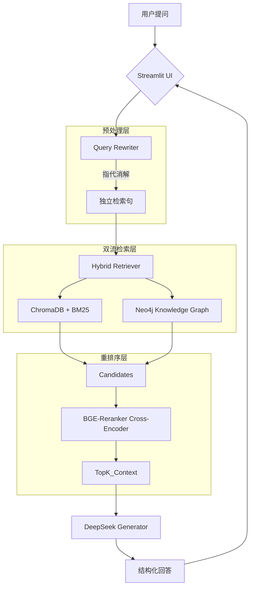

这是一份为您定制的 **ArchRAG Enterprise V3.40** 项目交付文档 (`README.md`)。

它不仅包含了项目的核心介绍，还整合了我们之前讨论过的部署流程、维护命令和架构逻辑。您可以直接将以下内容保存为项目根目录下的 `README.md` 文件。

---

# 🧠 ArchRAG Enterprise V3.40 | 工业级混合检索增强生成系统

    

**ArchRAG V3.40** 是一款专为**工业垂直领域（如 HVACR 暖通洁净行业）**设计的混合检索增强生成（Hybrid RAG）系统。

它突破了传统 RAG 仅依赖向量检索的局限，通过引入**知识图谱（Knowledge Graph）**和**多轮对话指代消解（Query Rewriting）**，实现了对工业复杂逻辑链的高精度检索与推理。

---

## 🌟 核心特性 (Key Features)

*   **⚡ 双流并行检索 (Dual-Stream Retrieval)**
    *   **文本流**：结合 `ChromaDB` (向量语义) 与 `BM25` (关键词匹配)，确保模糊语义与专有名词的双重召回。
    *   **知识流**：基于 `Neo4j` 图数据库，检索实体间的逻辑关系（如 `包含`、`参数`、`前置条件`），弥补非结构化文本的逻辑缺失。
*   **🔄 智能多轮对话改写 (Agentic Query Rewriter)**
    *   内置工业级改写器，能自动将“它的功率是多少？”还原为“AHU-01 空调机组的功率是多少？”。
    *   具备**34项指代词审计**与**工业括号保护**机制，防止检索漂移。
*   **⚖️ 异构晚期融合 (Late Fusion & Reranking)**
    *   使用 `BGE-Reranker` 对文本段落与图谱三元组进行统一打分排序，让 LLM 看到最优质的证据。
*   **🛡️ 生产级鲁棒性 (Production Robustness)**
    *   **异步安全**：基于 `nest_asyncio` 解决 Streamlit 线程冲突。
    *   **优雅降级**：当图数据库离线时，自动退化为纯文档模式，系统不崩溃。
    *   **输入防御**：防止长文本攻击与无意义查询。
*   **🐳 全容器化部署**
    *   基于 Docker Compose 编排，一键启动 App 与 Database，环境完全隔离。

---

## 🏗️ 系统架构



---

## 🛠️ 环境依赖 (Prerequisites)

*   **操作系统**: Windows / Linux
*   **硬件要求**: NVIDIA GPU (推荐 RTX 3090 或更高，显存 >= 24GB 以获得最佳性能)
*   **软件基础**:
    *   [Docker Desktop](https://www.docker.com/products/docker-desktop/) (Windows) 或 Docker Engine (Linux)
    *   [NVIDIA Container Toolkit](https://docs.nvidia.com/datacenter/cloud-native/container-toolkit/install-guide.html) (用于容器内调用 GPU)

---

## 🚀 快速部署指南 (Docker 模式)

### 1. 准备模型文件
系统不包含大模型权重文件，需手动下载至 `models/` 目录：
*   `models/bge-large-zh-v1.5/`
*   `models/bge-reranker-large/`

### 2. 配置环境变量
在项目根目录创建 `.env` 文件：

```env
# --- Neo4j 配置 ---
NEO4J_URI=bolt://neo4j-db:7687
NEO4J_USER=neo4j
NEO4J_PASSWORD=你的强密码
NEO4J_DATABASE=neo4j

# --- LLM 配置 ---
DEEPSEEK_API_KEY=sk-你的DeepSeekKey
```

### 3. 构建并启动容器
```powershell
docker-compose --env-file .env up -d --build
```
*首次构建需下载 PyTorch 镜像（约 3GB），请保持网络通畅。*

### 4. 关键：初始化知识图谱数据
Docker 里的数据库初始是空的，需执行以下命令将 CSV 数据导入容器内的 Neo4j：

```powershell
docker exec -it archrag-core python import_graph.py
```
*等待出现 `🎉 全部导入任务结束！` 即为成功。*

### 5. 访问系统
打开浏览器访问：**[http://localhost:8501](http://localhost:8501)**

---

## 📘 使用与维护手册

### 常用管理指令
---

### 📦 一、 系统全局管理 (Docker Compose)
*这些命令在项目根目录下执行，同时作用于 Python App 和 Neo4j。*

| 命令 | 作用 | 备注 |
| :--- | :--- | :--- |
| `docker-compose --env-file .env up -d --build` | **一键启动/更新** | 重新构建并后台运行（最常用） |
| `docker-compose down` | **彻底停止并移除** | 停止容器并删除虚拟网络，不丢数据 |
| `docker-compose stop` | **暂停服务** | 仅停止运行，保留容器状态 |
| `docker-compose start` | **恢复服务** | 启动之前被 stop 的容器 |
| `docker-compose ps` | **查看运行状态** | 检查容器是 `Up` 还是 `Exited` |
| `docker-compose restart` | **重启所有服务** | 修改配置后快速重启 |

---

### 🔍 二、 监控与排错 (Logs)
*当网页打不开或功能失效时，通过日志诊断。*

| 命令 | 作用 | 备注 |
| :--- | :--- | :--- |
| `docker-compose logs -f archrag-app` | **查看 App 实时日志** | 监控检索逻辑、LLM 调用情况 |
| `docker-compose logs -f neo4j-db` | **查看数据库实时日志** | 检查数据库启动、内存、连接错误 |
| `docker-compose logs --tail 100 archrag-app` | **查看最近100行日志** | 快速扫一眼最近发生了什么 |

---

### 🛠️ 三、 容器内部操作 (Exec)
*用于在不停止系统的情况下，向容器下达“指令”。*

| 命令 | 作用 | 重点！ |
| :--- | :--- | :--- |
| `docker exec -it archrag-core python import_graph.py` | **导入图谱数据** | **每次清空数据库后必做** |
| `docker exec -it archrag-core nvidia-smi` | **检查容器显卡** | 确认 3090 是否被正确透传 |
| `docker exec -it archrag-core /bin/bash` | **进入容器“指挥中心”** | 进去查看文件路径、手动跑测试代码 |
| `docker exec -it archrag-core pip list` | **查看容器已装插件** | 确认环境库版本 |

---

### 🧹 四、 资源清理 (Cleanup)
*Docker 运行久了会占用大量硬盘，需要定期“大扫除”。*

| 命令 | 作用 | 风险提示 |
| :--- | :--- | :--- |
| `docker system df` | **查看空间占用** | 看镜像、卷、缓存分别占了多少 |
| `docker system prune` | **清理无用资源** | 删除所有停止的容器和孤立网络（不丢数据） |
| `docker system prune -a` | **清理所有未使用的镜像** | **慎用**：会删除所有没在跑的镜像，下次启动要重下 |
| `docker volume prune` | **清理未挂载的数据卷** | **慎用**：可能会删除你没挂载的数据库数据 |

---

### 💡 针对 ArchRAG 的 3 个“救命”小贴士：

1.  **修改代码不生效？**
    *   如果你修改了 `rag/` 或 `core/` 里的代码，Docker 通常能自动感知（因为我们挂载了 Volume），但如果涉及 `Dockerfile` 或依赖变化，请务必使用 `docker-compose up -d --build` 强制重构。
2.  **网络下载太慢？**
    *   如果在构建时卡在 `pip install`，请检查宿主机 VPN 是否开启，且 Docker Desktop 的 **Proxies** 端口是否与 VPN 一致（例如 `29290`）。
3.  **Neo4j 连不上？**
    *   由于 Docker 内部网络机制，Python 代码中的 `NEO4J_URI` 必须是 `bolt://neo4j-db:7687`，**绝对不能**写 `localhost`（因为容器里的 localhost 是它自己，不是数据库容器）。


### 数据更新流程
若有新的 PDF 文档需要入库：
1.  将 PDF 放入处理流程，生成新的 `structured_chunks.jsonl` 和 `graph/*.csv`。
2.  覆盖项目目录下的对应文件。
3.  **重建索引**：
    *   进入容器：`docker exec -it archrag-core /bin/bash`
    *   运行索引器：`python rag/indexer.py`
    *   运行图谱导入：`python import_graph.py`
4.  重启应用容器以重新加载内存索引。

---

## 📂 项目结构说明

```text
D:\KG_Test\
│
├── __init__.py
├── .env                        # [机密] 存放 DEEPSEEK_API_KEY, NEO4J_PASSWORD
├── config.py                   # [中枢] 系统总配置 
├── main_pipeline.py                     # [入口] 离线任务入口 (数据清洗 -> 知识提取 -> 导出)
├── main_rag.py                 # [入口] 在线服务入口 (启动 RAG 聊天机器人) [待创建]
├── docker-compose.yml      # 容器编排配置
├── Dockerfile              # 应用镜像构建文件
├── import_graph.py         # 图谱数据导入脚本
├── Global_HVACR_Ontology_Policy V1.5.0.md   #宪法（法律条文）
├── README.md
├── requirements.txt
├── 操作指令.txt
│
├── test/     #Python 虚拟环境
│
├── Project_Context_Master/     
│   ├── Project_Context_Master V1.0.md
│   ├── Project_Context_Master V1.1.md
│   ├── Project_Context_Master V1.2.md
│   ├── Project_Context_Master V1.3.md
│   ├── Project_Context_Master V1.4.md
│   └── Project_Context_Master V1.5.md
│
├── jsonl/                      # [数据层 - 源头与中间态]
│   ├── structured_chunks.jsonl     # 原始切片 (由 ingestion 生成)
│   └── graph_data_ultimate.jsonl   # 提取结果 (含大法官判词)
│
├── graph/                      # [数据层 - 图谱交付物]
│   ├── neo4j_nodes.csv             # 实体节点表
│   └── neo4j_relationships.csv     # 关系链路表
│
├── monitor/                    # [日志层 - 黑匣子]
│   ├── monitor.log                 # 系统运行流水账
│   └── debug_*.txt                 # (调试模式下) 各个 Agent 的中间输出
│   └── agent_stats.json           # 性能统计
│
├── bm25/                       # [索引层 - 稀疏索引]
│   └── bm25.pkl                    # 关键词倒排索引文件
│
├── chroma_db/                  # [索引层 - 密集向量]
│   ├── chroma.sqlite3              # 向量数据库主文件
│   └── (其他 UUID 文件夹)
│
├── models/                     # [模型层 - 本地军火库]
│   ├── bge-large-zh-v1.5/          # Embedding 模型权重文件
│   └── bge-reranker-large/         # Reranker 模型权重文件
│
├── Prompt/                     # [策略层 - 提示词]
│   ├── 1 激进派 ok.txt
│   ├── 2 保守派 ok.txt
│   ├── 3 对抗派 ok.txt
│   └── 4 大法官 ok.txt
│
├── tools/
│   ├── __init__.py             # (空文件) 标识为包
│   ├── analyze_stats.py     # 分析 graph_data_ultimate.jsonl 日志
│   ├── auto_import.py        # 批量导入到 Neo4j 图数据库
│   ├── clean_failed_checkpoints.py     # 自动删除那些标记为“失败 (success: false)”的记录
│   └── fix_data_ids.py          # 自动补全chunk_id
│
├── core/                       # [核心业务层 - V2.1 提取引擎]
│   ├── __init__.py             # (空文件) 标识为包
│   ├── models.py               # 数据契约 (自洁逻辑)
│   ├── pipeline.py             # 流水线调度
│   ├── agents.py               # 四方智能体逻辑
│   ├── prompts.py              # Prompt加载与防爆
│   ├── llm_client.py           # 异步通讯兵
│   ├── database.py             # 导出与全局去重
│   ├── monitoring.py           # 监控实现
│   └── utils.py                # JSON解析与断点续传
│
├── rag/                        # [应用服务层 - V3.4 检索生成]
│   ├── __init__.py             # 暴露核心类
│   ├── indexer.py              # 索引构建器 (Vector + BM25)
│   ├── retriever.py            # 三位一体混合检索器
│   ├── graph_search.py         # 图谱检索接口
│   ├── fusion.py               # RRF 融合算法
│   ├── reranker.py             # 重排序模型接口
│   ├── generator.py            #  答案生成器
│   ├── rewriter.py         # 多轮对话改写器
│   └── app.py                  # Streamlit 前端界面
│
└── ingestion/                  # [上游注入层 - 采矿场]
    ├── __init__.py             # 暴露接口
    ├── processor.py            # 总调度
    ├── pdf_loader_api.py       # MinerU 封装
    ├── docx_loader.py          # MarkItDown 封装
    └── txt_loader.py           # 文本切分器
```

---

## ⚠️ 常见问题排查 (Troubleshooting)

1.  **启动时报错 `Client.Timeout` 或 `Connection Refused`**
    *   **原因**：Docker 无法拉取镜像。
    *   **解决**：检查 Docker Desktop 的 Proxies 设置。如果开启了 VPN，请确保端口号（如 7890）与 VPN 软件一致；如果没开 VPN，请关闭 Docker 代理。

2.  **侧边栏显示“知识图谱：🔴 离线”**
    *   **原因**：Neo4j 容器未启动或密码错误。
    *   **解决**：检查 `docker-compose ps`，如果 neo4j 状态是 `Restarting`，请检查 `.env` 密码是否包含特殊字符。

3.  **多轮对话改写不生效（还是显示“它”）**
    *   **原因**：改写器逻辑过于保守，回退到了原句。
    *   **解决**：检查 `rag/rewriter.py` 中的日志，确认是否触发了指代残留审计。

---

**ArchRAG V3.40**
*Built for Industrial Precision.*